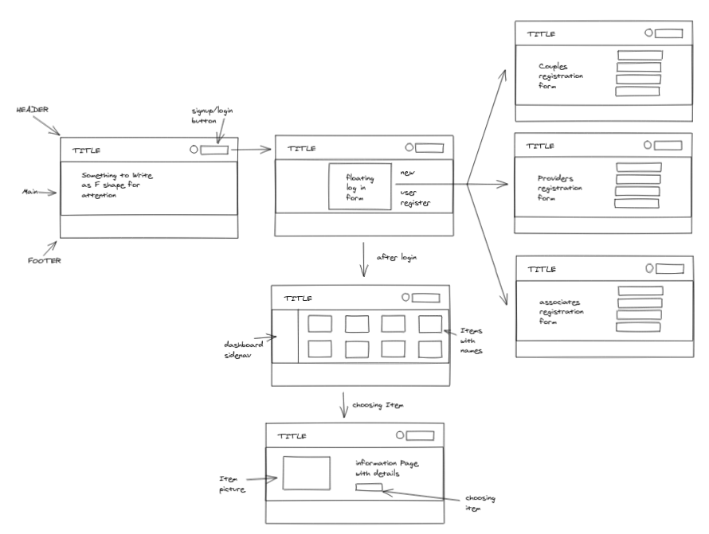

# Wireframe:

____

# User Stories: 

1. As a Couple I want to search for a wedding avenue and wedding planning companies.

2. As a Couple I want to choose a photographer and accessories for the wedding. 

3. As a Couple I want book my wedding on a date from my choosing.

4. As a provider I want the ability to add my Brand and services. 

5. As a provider I want the ability to set my own price and conditions. 

6. As an associate I want the ability to show my previous works. 

7. As an associate I want the ability to set my own conditions and price.

8. STRETCH - As a couple I want the ability to set a wedding budget. 

9. STRETCH - As a couple I want the ability to compare prices.

____

# Features: 

1. Couples accounts with their data saved on it. 

2. Search for whatever you like. 

3. Allow the providers to register themselves with their prices and conditions. 

4. Allow associates to register themselves with and talk about their work. 

5. Couples have the ability to choose from a list of defferent categories. 

6. Pictures and images will be provided by all providers and associates so the couples can see.

____

# Acceptance user tests: 

